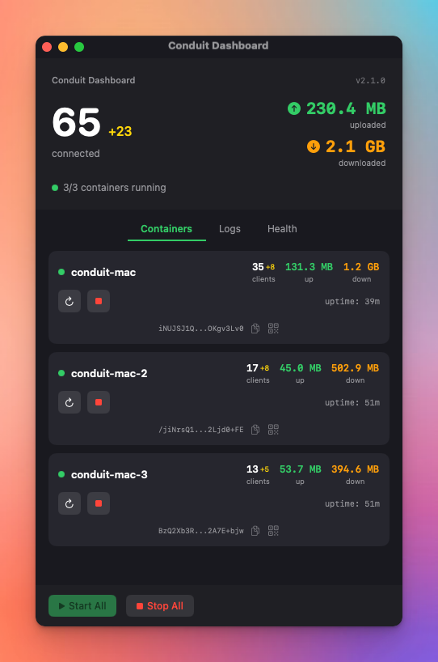
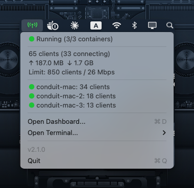
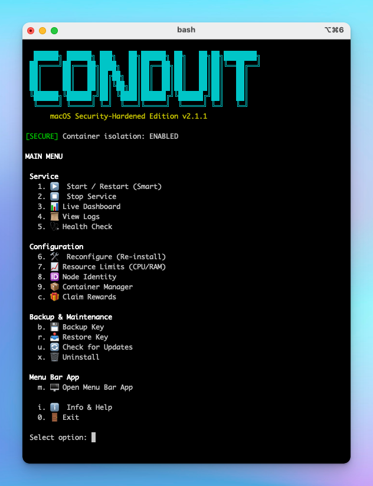
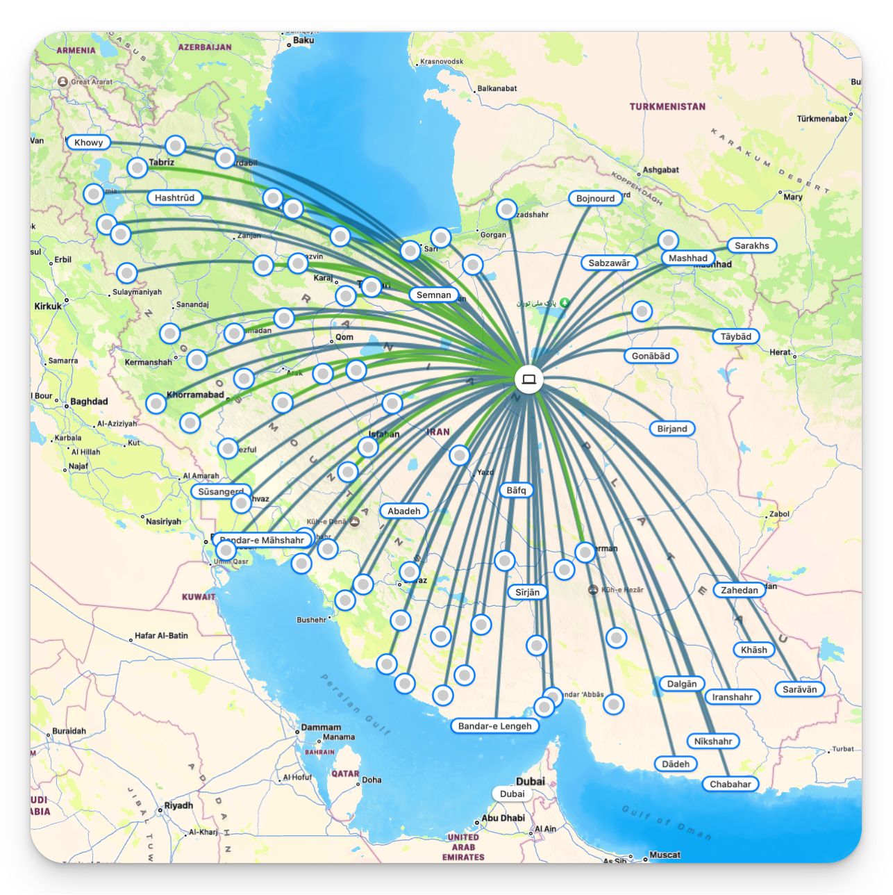

<h1 align="center">
  
</h1>

<h1 align="center">Psiphon Conduit Manager</h1>
<p align="center"><strong>macOS Edition • v2.1.1</strong></p>

<p align="center">
  <b>Help people in censored regions access the free internet.</b><br>
  Run a <a href="https://conduit.psiphon.ca/">Psiphon Conduit</a> proxy node safely on your Mac.
</p>

<p align="center">
  <a href="#-quick-start">Quick Start</a> •
  <a href="#️-security">Security</a> •
  <a href="#-features">Features</a> •
  <a href="#نصب-برای-ایرانیان-خارج-از-کشور">فارسی</a>
</p>

<p align="center">
  
  
  
  
</p>

---

<p align="center">
  
</p>

<p align="center"><em>Dashboard with real-time stats, Node IDs, and QR codes for rewards</em></p>

---

## ⚡ Quick Start

### 1. Install Docker Desktop
Download from **[docker.com/products/docker-desktop](https://www.docker.com/products/docker-desktop/)**

### 2. Install Conduit Manager
```bash
curl -fsSL https://raw.githubusercontent.com/moghtaderi/conduit-manager-mac/main/install.sh | bash
```

### 3. Run & Configure
```bash
~/conduit-manager/conduit-mac.sh
```
Press `7` → Set limits • Press `6` → Install • Press `m` → Open Menu Bar App

**Done!** Your node is now helping people access the free internet.

---

## 🛡️ Security

### Your Mac is Fully Protected

Running Conduit in Docker provides **complete isolation**. The container:

- 🔒 **Cannot access your files** - Read-only filesystem
- 🌐 **Cannot see your network** - Isolated bridge network
- ⬇️ **Has minimal privileges** - All capabilities dropped
- 📊 **Is resource-limited** - CPU & RAM capped to your settings
- 🛑 **Cannot make dangerous calls** - Seccomp syscall filtering
- 🚫 **Cannot escalate privileges** - No root access possible
- ✅ **Verified images** - Docker image digest verification
- ✅ **Safe updates** - Content validation before install

> **Why Docker?** Even if Conduit were compromised, it cannot access your files, see your traffic, or persist after removal.

---

## 🖥️ Menu Bar & CLI

<p align="center">
  &nbsp;&nbsp;&nbsp;&nbsp;
</p>

<p align="center">
  <em>Menu Bar: Quick status</em> &nbsp;•&nbsp; <em>CLI: Full configuration</em>
</p>

---

## ✨ Features

| Feature | Description |
|:-------:|-------------|
| **Multi-Container** | Run up to 5 Conduit nodes simultaneously |
| **Dashboard** | Full stats with Node IDs and QR codes |
| **Menu Bar App** | Native macOS status at a glance |
| **Live Stats** | Connected clients & traffic in real-time |
| **QR Codes** | Scan to claim rewards in Ryve app |
| **Backup/Restore** | Never lose your Node ID |
| **Auto-Updates** | One-click updates with verification |

---

## 📦 Multi-Container

Run multiple nodes via **Container Manager** (option `9`):

```
═══ CONTAINER MANAGER ═══

  NAME              STATUS     CLIENTS
  conduit-mac       Running    33
  conduit-mac-2     Running    13
  conduit-mac-3     Running    9
```

Each container has its own Node ID and rewards tracking.

---

## ❓ FAQ

**Will updating lose my Node ID?**
> No. Your Node ID is in a Docker volume, preserved during updates.

**How do I backup my Node ID?**
> Press `b` in CLI. Backups go to `~/.conduit-backups/`

**Is this safe?**
> Yes. Docker provides complete isolation. See [Security](#️-security).

---

## 🗑️ Uninstall

Press `x` in the CLI menu, or:
```bash
docker stop conduit-mac && docker rm conduit-mac
docker volume rm conduit-data && docker network rm conduit-network
rm -rf ~/conduit-manager ~/.conduit-*
```

---

## Credits

- [Psiphon](https://psiphon.ca/) - Conduit project
- [SamNet-dev/conduit-manager](https://github.com/SamNet-dev/conduit-manager) - Original script

---

<a id="نصب-برای-ایرانیان-خارج-از-کشور"></a>

<div dir="rtl" align="right">

## نصب برای ایرانیان خارج از کشور

### این برنامه کاملاً امن است

Conduit داخل Docker اجرا می‌شود - یک محیط کاملاً ایزوله:

- ❌ به فایل‌های شما دسترسی ندارد
- ❌ به شبکه محلی دسترسی ندارد
- ❌ نمی‌تواند چیزی نصب کند
- ✅ فقط به مردم ایران کمک می‌کند به اینترنت آزاد دسترسی پیدا کنند

### نصب

**۱.** Docker Desktop را از [docker.com](https://www.docker.com/products/docker-desktop/) نصب کنید

**۲.** این دستور را اجرا کنید:

</div>

```bash
curl -fsSL https://raw.githubusercontent.com/moghtaderi/conduit-manager-mac/main/install.sh | bash
```

<div dir="rtl" align="right">

**۳.** برنامه را باز کنید:

</div>

```bash
~/conduit-manager/conduit-mac.sh
```

<div dir="rtl" align="right">

**۴.** کلید `7` سپس `6` سپس `m`

</div>

---

<p align="center">
  
</p>

<h2 align="center">#FreeIran 🕊️</h2>

<p align="center"><em>Every node helps someone access the free internet</em></p>

---

<p align="center">MIT License</p>
